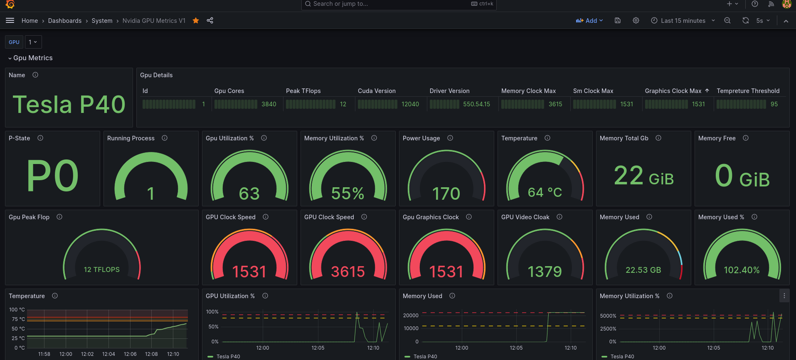

# Nvidia Metrics

The repository, `nvidia-metrics`, leverages the Nvidia Management Library (NVML), a C-based API that can interface with Nvidia GPUs. This repository gives a clear insight into the usage statistics of Nvidia GPUs like temperature, power consumption, memory usage, etc. It is intended for developers working on high performance computing, machine learning, and other GPU-intensive tasks. The gathered metrics are transmitted to Prometheus and Grafana for visualization.




## Getting Started

These instructions will provide you a guideline for installing prerequisites, running the application, and building necessary files.

### Prerequisites

To use this repository, you should have the Nvidia CUDA toolkit installed on your system.

You can install the toolkit via:

```bash
sudo apt-get install nvidia-cuda-toolkit
```

### Installing & Running the application

Clone the repository to your local machine.

```bash
git clone <repo_link>
```

Navigate to the cloned directory.

```bash
cd nvidia-metrics
```

Compile the project.

```bash
make
```

After the project has been compiled, run the resulting binary.

```bash
./nvidiaMetrics --config config/metrics.yaml
```

```bash
docker run -e CONFIG_FILE=/path/to/config.yaml \
           -e LOG_LEVEL=debug \
           -e PORT=8080 \
           -e HOST=0.0.0.0 \
           -e INTERVAL=10 \
           your-image-name

```

## Built With

- NVML - A C-based GO API for monitoring and managing Nvidia GPUs.
- CUDA - A parallel computing platform and programming model developed by Nvidia for general computing on GPUs.

## Contributing

Please read [CONTRIBUTING.md](CONTRIBUTING.md) for details on our code of conduct and the process for submitting pull requests.

## License

This project is licensed under the MIT License.

## Contact

Please feel free to contact the project maintainers if you encounter any issues or have any enquiries about the repository.

We hope you find this repository useful in your venture!
